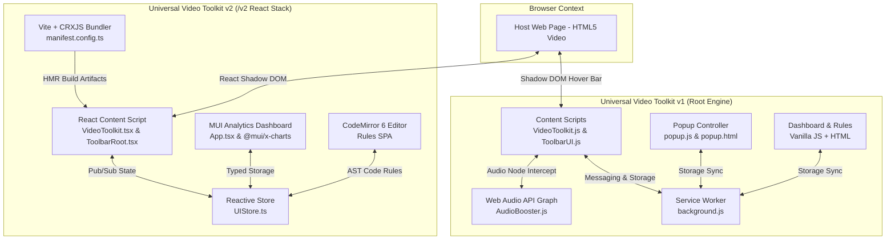

# 🎬 Universal Video Toolkit (Multipurpose Video Toolkit)

[](manifest.json)
[](https://developer.chrome.com/docs/extensions/mv3/intro/)
[](LICENSE)

**Universal Video Toolkit** is a feature-rich, high-performance browser extension designed to upgrade video playback across any website on the internet. Whether you are watching YouTube, Vimeo, Twitter/X, Instagram, embedded course players, or custom HTML5 video elements, Universal Video Toolkit provides an intuitive hover-control overlay, advanced 8-band audio equalization, frame-by-frame seeking, A/B looping, screen/canvas recording, media sniffing & downloading, local usage analytics, and custom per-site CSS/JS script injection.

---

## 📚 Documentation Index

The project is structured into two major architectural versions:

1. **`README_v1.md`** — **Universal Video Toolkit v1 (Vanilla JS Engine)**
   - Zero-dependency, pure Vanilla JavaScript implementation.
   - Low memory footprint, custom Web Component Shadow DOM overlay.
   - Deep dive into Web Audio API gain boost, 8-band peaking filters, MediaRecorder API, and Chrome Extension Manifest V3 architecture.
   - 👉 **[Read full v1 Architecture Documentation](README_v1.md)**

2. **`README_v2.md`** — **Universal Video Toolkit v2 (React 19 + TypeScript + Vite Stack)**
   - Modernized enterprise-grade refactor located in the [`/v2`](v2/) directory.
   - Built with **React 19**, **TypeScript**, **Vite**, **CRXJS**, **CodeMirror 6**, and **Material UI (MUI)**.
   - Reactive UI store (`UIStore.ts`), Shadow DOM Emotion CSS caching, CodeMirror rules editor, and MUI charts for usage analytics.
   - 👉 **[Read full v2 Architecture Documentation](README_v2.md)**

---

## ✨ Core Features At A Glance

| Feature Category | Capability | Description |
| :--- | :--- | :--- |
| **Hover Controls Overlay** | Playback & Transform | Instant speed toggles (0.25x – 4.0x), frame-by-frame seeking (±0.04s), video rotation (90°/180°/270°), picture-in-picture, cinema/focus mode, fullscreen. |
| **Audio Engineering** | 8-Band Equalizer & Gain | Up to 600% volume boost using Web Audio API `AudioContext` and `GainNode`, plus an 8-band equalizer (60Hz – 14kHz) with presets (Bass Boost, Vocal, Treble, Flat, Rock, Jazz). |
| **Precision Looping** | A/B Loop | Set custom Start (A) and End (B) timestamps with visual indicators on the video timeline for repeated study/practice. |
| **Media Recorder** | Capture & Export | High-quality WebM video recording of player elements via `captureStream()` or fallback HTML5 Canvas capture, plus single-frame PNG screenshots. |
| **Network Media Sniffer** | Downloader | Service Worker network sniffer (`chrome.webRequest`) detects direct media streams with resolution hints (1080p, 720p, etc.) and file sizes for 1-click downloads. |
| **Custom Site Injector** | CSS / JS Code Editor | Inject custom per-site CSS rules or JavaScript snippets into the web page's `MAIN` world execution context. |
| **Usage Analytics** | Local Dashboard | Track daily watch time, playback speed distributions, top domains, and session history locally with full privacy. |
| **Opt-in Privacy Model** | Site Allowlist | By default, extension features are inactive per site until opted-in via the popup or master switch, ensuring zero page overhead on unused sites. |

---

## 🏗️ High-Level System Architecture Comparison



---

## 🚀 Quick Start Guide

### Option A: Loading Version 1 (Vanilla JS Extension)

1. Clone or download this repository:
   ```bash
   git clone https://github.com/PavanKalyanV5/Multipurpose-Video-Toolkit.git
   ```
2. Open Google Chrome (or any Chromium browser like Edge / Brave).
3. Navigate to `chrome://extensions/`.
4. Enable **Developer mode** (toggle in the top right corner).
5. Click **Load unpacked** and select the root directory of this repository (`universal-video-toolkit`).
6. Navigate to any website with a video (e.g. YouTube or Vimeo), click the extension icon to enable the site, and hover over any video player!

---

### Option B: Building & Running Version 2 (React 19 + Vite + TypeScript)

1. Navigate to the `v2` directory:
   ```bash
   cd v2
   ```
2. Install node dependencies:
   ```bash
   npm install
   ```
3. Start the Vite development server (with HMR):
   ```bash
   npm run dev
   ```
4. Or build the production extension bundle:
   ```bash
   npm run build
   ```
5. In Chrome (`chrome://extensions/`), click **Load unpacked** and select the `v2/dist` folder.

---

## 📁 Repository Structure Overview

```
universal-video-toolkit/
├── manifest.json              # Extension Manifest V3 (v1 root)
├── background.js              # Background service worker & media sniffer
├── content.js                 # Content script entry point
├── popup.html / popup.js      # Extension popup UI & controller
├── dashboard.html / rules.html# Analytics dashboard & code injection editor
├── src/                       # v1 Core Modules
│   ├── content/               # VideoToolkit, AudioBooster, ToolbarUI, ABLoop, etc.
│   ├── rules/                 # Custom CSS/JS injector script
│   └── dashboard/ & popup/    # Module stylesheets & controllers
├── v2/                        # Version 2 Modernized React Stack
│   ├── package.json           # Dependencies (React 19, MUI, CodeMirror 6, Vite)
│   ├── vite.config.ts         # Vite build configuration with CRXJS plugin
│   ├── manifest.config.ts     # TypeScript Manifest V3 generator
│   └── src/                   # React components, UI store, pages, background
├── README.md                  # Master README (This document)
├── README_v1.md               # Thorough Architecture Documentation for v1
└── README_v2.md               # Thorough Architecture Documentation for v2
```

---

## 📜 License

This project is open source and available under the [MIT License](LICENSE).
