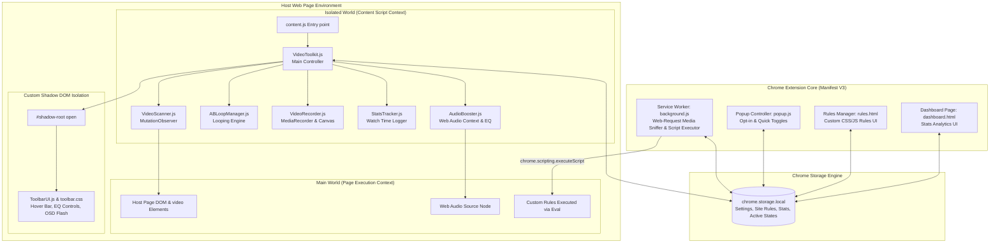
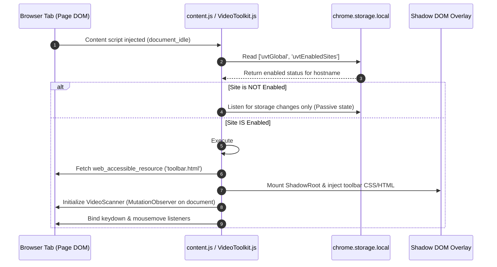
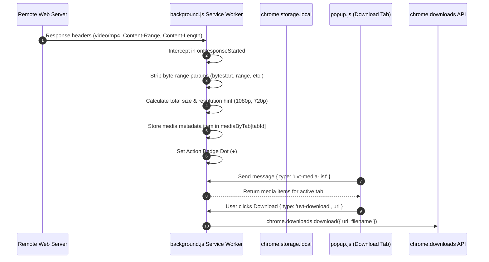
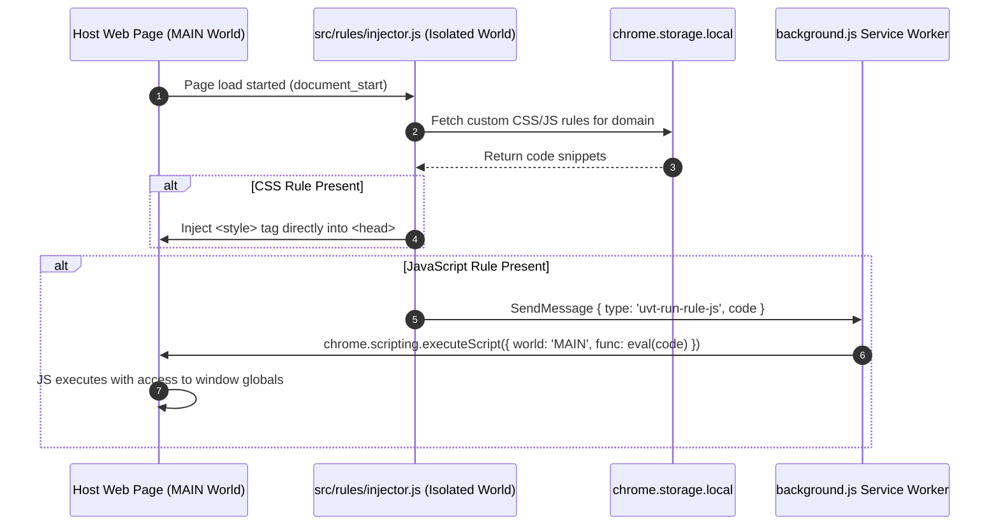

# 🛠️ Universal Video Toolkit v1 — Architecture & Technical Manual

> **Extension Version**: 4.0.0 (Manifest V3)  
> **Core Tech Stack**: Vanilla JavaScript (ES6+ Modules), HTML5 Web APIs, Web Audio API, Web Components / Custom Shadow DOM, Chrome Extension Storage & Scripting APIs.

---

## 📖 Table of Contents
1. [Executive Summary](#1-executive-summary)
2. [High-Level Architecture Overview](#2-high-level-architecture-overview)
3. [Core Sub-System Breakdown](#3-core-sub-system-breakdown)
   - [3.1 Content Script Orchestrator (`VideoToolkit.js`)](#31-content-script-orchestrator-videotoolkitjs)
   - [3.2 DOM Video Scanner & Observer (`VideoScanner.js`)](#32-dom-video-scanner--observer-videoscannerjs)
   - [3.3 Shadow DOM Hover UI (`ToolbarUI.js` & `toolbar.html`)](#33-shadow-dom-hover-ui-toolbaruijs--toolbarhtml)
   - [3.4 Web Audio API Equalizer & Booster (`AudioBooster.js`)](#34-web-audio-api-equalizer--booster-audioboosterjs)
   - [3.5 Precision A/B Loop Manager (`ABLoopManager.js`)](#35-precision-ab-loop-manager-abloopmanagerjs)
   - [3.6 Media Recording Engine (`VideoRecorder.js`)](#36-media-recording-engine-videorecorderjs)
   - [3.7 Background Media Sniffer & Rules Dispatcher (`background.js`)](#37-background-media-sniffer--rules-dispatcher-backgroundjs)
   - [3.8 Custom CSS/JS Site Injector (`injector.js` & `rules.html`)](#38-custom-cssjs-site-injector-injectorjs--ruleshtml)
   - [3.9 Usage Analytics Tracker (`StatsTracker.js` & `dashboard.html`)](#39-usage-analytics-tracker-statstrackerjs--dashboardhtml)
4. [Detailed Data Flow & Sequence Diagrams](#4-detailed-data-flow--sequence-diagrams)
   - [4.1 Initialization & Per-Site Opt-in Sequence](#41-initialization--per-site-opt-in-sequence)
   - [4.2 Web Audio Node Graph & Equalizer Routing](#42-web-audio-node-graph--equalizer-routing)
   - [4.3 Background Network Media Sniffing & Download Pipeline](#43-background-network-media-sniffing--download-pipeline)
   - [4.4 Custom JavaScript Injection Execution Flow](#44-custom-javascript-injection-execution-flow)
5. [Detailed Lifecycle & Operational Mechanics](#5-detailed-lifecycle--operational-mechanics)

---

## 1. Executive Summary

Universal Video Toolkit v1 is built with a zero-dependency design philosophy. By leveraging raw Web APIs and Chrome Extension Manifest V3 primitives, it offers instant load speeds and zero JS runtime bundle overhead.

The extension operates on an **Opt-in Privacy & Performance Model**: content scripts are injected into web pages, but remain completely passive (performing zero DOM mutation or continuous event listening) until the user opts in for the current hostname or enables the master switch.

---

## 2. High-Level Architecture Overview



---

## 3. Core Sub-System Breakdown

### 3.1 Content Script Orchestrator (`VideoToolkit.js`)
- **File Path**: [`src/content/VideoToolkit.js`](file:///c:/Users/DELL/Downloads/universal-video-toolkit/src/content/VideoToolkit.js)
- **Role**: Central controller managing module instantiation, storage synchronization, keyboard shortcuts (`Shift+S`, `Shift+D`, `Shift+R`, `Shift+E`, etc.), and hover detection.
- **Key Mechanics**:
  - Checks `chrome.storage.local` key `uvtEnabledSites` and `uvtGlobal`.
  - Lazy-activates sub-systems (`VideoScanner`, `ToolbarUI`, `AudioBooster`) only if the site is active.
  - Maintains `WeakMap` references (`#rotations`, `#rotationObservers`) for video transformations (0°, 90°, 180°, 270°) and protects against host sites attempting to clear custom inline styles.

### 3.2 DOM Video Scanner & Observer (`VideoScanner.js`)
- **File Path**: [`src/content/VideoScanner.js`](file:///c:/Users/DELL/Downloads/universal-video-toolkit/src/content/VideoScanner.js)
- **Role**: Continuously detects standard `<video>` elements, iframe-embedded video elements, and shadow-root embedded video elements.
- **Key Mechanics**:
  - Uses `MutationObserver` on `document.documentElement` to capture dynamically inserted videos (e.g. Single Page Applications like YouTube / TikTok).
  - Handles `mouseEnter` and `mouseLeave` boundaries over target video containers to signal `ToolbarUI.js`.

### 3.3 Shadow DOM Hover UI (`ToolbarUI.js` & `toolbar.html`)
- **File Paths**: [`src/content/ToolbarUI.js`](file:///c:/Users/DELL/Downloads/universal-video-toolkit/src/content/ToolbarUI.js), [`src/content/toolbar.html`](file:///c:/Users/DELL/Downloads/universal-video-toolkit/src/content/toolbar.html), [`src/content/toolbar.css`](file:///c:/Users/DELL/Downloads/universal-video-toolkit/src/content/toolbar.css)
- **Role**: Renders control overlays (Speed pills, Frame seek buttons, Equalizer popover, Screenshot, Cinema mode trigger, OSD Flash notifications).
- **Key Mechanics**:
  - Uses an `#shadow-root` open tree to encapsulate all extension styles. Host page CSS framework rules (Tailwind, Bootstrap, reset sheets) **cannot break or bleed into** the control bar UI.
  - Dynamically recalculates position (`top`, `left`, `width`) relative to the active `<video>` bounding client rectangle (`getBoundingClientRect()`).

### 3.4 Web Audio API Equalizer & Booster (`AudioBooster.js`)
- **File Path**: [`src/content/AudioBooster.js`](file:///c:/Users/DELL/Downloads/universal-video-toolkit/src/content/AudioBooster.js)
- **Role**: Intercepts HTML5 `<video>` audio output and routes it through an advanced Web Audio API graph.
- **Key Mechanics**:
  - Creates a `AudioContext` and wraps the video element via `createMediaElementSource(video)`.
  - Connects a `GainNode` allowing volume multiplier up to **600%** (6.0x amplification).
  - Chains 8 `BiquadFilterNode` peaking filters centered at frequencies: **60Hz, 170Hz, 350Hz, 1kHz, 3kHz, 6kHz, 12kHz, 14kHz**.
  - Provides built-in EQ presets: `Flat`, `Bass Boost`, `Vocal`, `Treble`, `Rock`, `Jazz`.

### 3.5 Precision A/B Loop Manager (`ABLoopManager.js`)
- **File Path**: [`src/content/ABLoopManager.js`](file:///c:/Users/DELL/Downloads/universal-video-toolkit/src/content/ABLoopManager.js)
- **Role**: Manages high-precision time segment looping.
- **Key Mechanics**:
  - Binds `timeupdate` listeners to the active video element.
  - When `video.currentTime >= loopEnd`, it immediately executes `video.currentTime = loopStart`.
  - Visual markers are injected onto video timeline bars when available.

### 3.6 Media Recording Engine (`VideoRecorder.js`)
- **File Path**: [`src/content/VideoRecorder.js`](file:///c:/Users/DELL/Downloads/universal-video-toolkit/src/content/VideoRecorder.js)
- **Role**: Screen and canvas recording of live video playback directly to WebM files.
- **Key Mechanics**:
  - Primary path: Calls `video.captureStream()` or `video.mozCaptureStream()`.
  - Fallback path (CORS restricted video elements): Renders video frames at 30 FPS onto a hidden `<canvas>` element and invokes `canvas.captureStream()`.
  - Encodes streams using `MediaRecorder` with `video/webm;codecs=vp9` or `vp8`, saving chunks into a Blob and auto-triggering download.

### 3.7 Background Media Sniffer & Rules Dispatcher (`background.js`)
- **File Path**: [`background.js`](file:///c:/Users/DELL/Downloads/universal-video-toolkit/background.js)
- **Role**: Service worker running network traffic sniffers and handling extension action messaging.
- **Key Mechanics**:
  - Binds to `chrome.webRequest.onResponseStarted`. Filters `Content-Type` matching `video/mp4`, `video/webm`, `video/quicktime`.
  - Strips byte-range URL query parameters (`bytestart`, `byteend`, `range`) to reconstruct full video URLs for direct downloads.
  - Calculates file sizes from `Content-Range` or `Content-Length` headers and derives quality hints (`1080p`, `720p`, `480p`).
  - Highlights the extension action badge icon (`●` blue dot) when downloadable media is detected on a tab.

### 3.8 Custom CSS/JS Site Injector (`injector.js` & `rules.html`)
- **File Paths**: [`src/rules/injector.js`](file:///c:/Users/DELL/Downloads/universal-video-toolkit/src/rules/injector.js), [`rules.html`](file:///c:/Users/DELL/Downloads/universal-video-toolkit/rules.html)
- **Role**: User-script style manager allowing per-domain custom CSS rules and JavaScript snippets.
- **Key Mechanics**:
  - Runs at `document_start` across all frames.
  - Injects `<style>` tags directly into `document.head` for CSS rules.
  - For JavaScript rules, sends `uvt-run-rule-js` message to `background.js`, which executes the code via `chrome.scripting.executeScript({ world: 'MAIN' })`, granting the script direct access to host page JS variables (e.g. `window.player`).

### 3.9 Usage Analytics Tracker (`StatsTracker.js` & `dashboard.html`)
- **File Paths**: [`src/content/StatsTracker.js`](file:///c:/Users/DELL/Downloads/universal-video-toolkit/src/content/StatsTracker.js), [`dashboard.html`](file:///c:/Users/DELL/Downloads/universal-video-toolkit/dashboard.html)
- **Role**: Logs local watch time, average speed, and session counts partitioned by website domain into `chrome.storage.local`.
- **Key Mechanics**:
  - Monitors `play`, `pause`, and `timeupdate` events to compute active watch seconds.
  - Aggregates records locally into `uvt_stats_v1` without sending external network requests (100% privacy).

---

## 4. Detailed Data Flow & Sequence Diagrams

### 4.1 Initialization & Per-Site Opt-in Sequence



---

### 4.2 Web Audio Node Graph & Equalizer Routing

```mermaid
graph LR
    subgraph Host Media Element
        V[HTML5 video Element]
    end

    subgraph Web Audio API Context (AudioBooster.js)
        AC[AudioContext]
        Source[MediaElementAudioSourceNode]
        GainNode[GainNode - Volume Boost up to 600%]
        
        subgraph 8-Band Equalizer (BiquadFilterNodes)
            F1[60 Hz Peaking Filter]
            F2[170 Hz Peaking Filter]
            F3[350 Hz Peaking Filter]
            F4[1 kHz Peaking Filter]
            F5[3 kHz Peaking Filter]
            F6[6 kHz Peaking Filter]
            F7[12 kHz Peaking Filter]
            F8[14 kHz Peaking Filter]
        end

        Destination[AudioContext Destination - Speakers]
    end

    V -->|createMediaElementSource| Source
    Source --> GainNode
    GainNode --> F1
    F1 --> F2
    F2 --> F3
    F3 --> F4
    F4 --> F5
    F5 --> F6
    F6 --> F7
    F7 --> F8
    F8 --> Destination
```

---

### 4.3 Background Network Media Sniffing & Download Pipeline



---

### 4.4 Custom JavaScript Injection Execution Flow



---

## 5. Detailed Lifecycle & Operational Mechanics

1. **Injection Point**: Injected at `document_idle` via `manifest.json`.
2. **Shadow DOM Encapsulation**: Avoids style contamination by attaching `#shadow-root` directly to target video wrapper containers.
3. **Audio Interception Safeguard**: Cross-Origin resource sharing (CORS) check automatically bypasses Web Audio API graph creation if cross-origin audio access is blocked by server CORS policy, preventing audio silences.
4. **Playback Rate Control**: YouTube and custom HTML5 video players often reset playback speeds when switching resolution or tracks. `VideoToolkit.js` utilizes both `ratechange` event monitoring and YouTube-specific `player.setPlaybackRate()` execution in `MAIN` world to guarantee persistent user speed choices.
