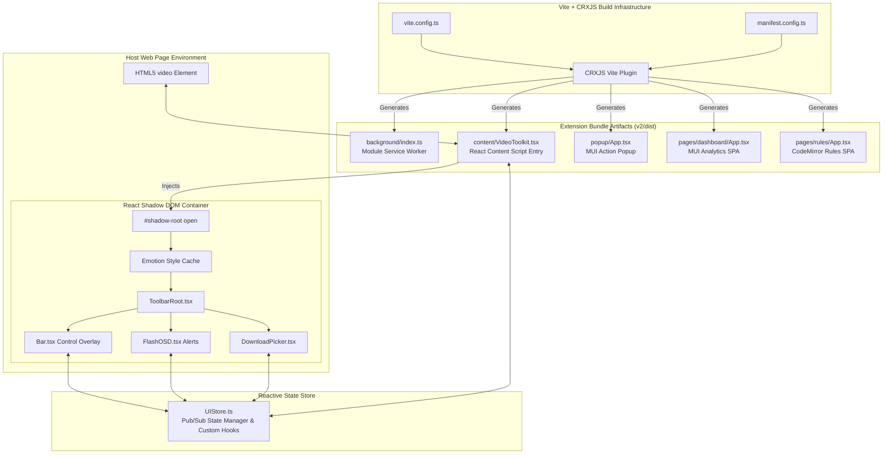
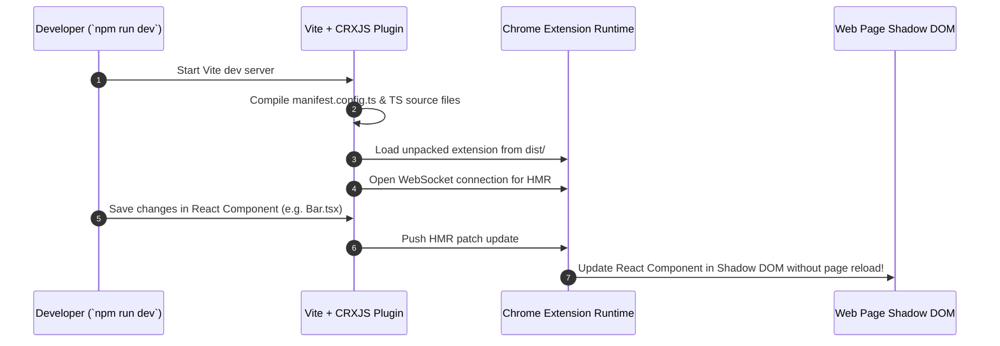
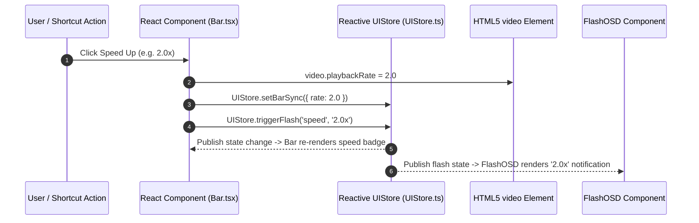

# ⚡ Universal Video Toolkit v2 — Architecture & Technical Manual

> **Extension Version**: 5.0.0 (Manifest V3 Modernized Refactor)  
> **Location**: [`/v2`](v2/) directory  
> **Core Tech Stack**: React 19, TypeScript 6.0, Vite 8, `@crxjs/vite-plugin` 2.7, Emotion CSS-in-JS (Shadow DOM Caching), CodeMirror 6 (`@uiw/react-codemirror`), Material UI (`@mui/material`, `@mui/x-charts`).

---

## 📖 Table of Contents
1. [Executive Summary & Evolution](#1-executive-summary--evolution)
2. [Key Architectural Upgrades Over v1](#2-key-architectural-upgrades-over-v1)
3. [System Architecture Overview](#3-system-architecture-overview)
4. [Directory & Sub-System Map](#4-directory--sub-system-map)
   - [4.1 Vite + CRXJS Build Pipeline](#41-vite--crxjs-build-pipeline)
   - [4.2 Reactive UI Store (`UIStore.ts`)](#42-reactive-ui-store-uistorets)
   - [4.3 React Content Script & Component Engine (`ToolbarRoot.tsx`)](#43-react-content-script--component-engine-toolbarroottsx)
   - [4.4 CodeMirror 6 Site Rules Editor (`v2/src/pages/rules/`)](#44-codemirror-6-site-rules-editor-v2srcpagesrules)
   - [4.5 MUI Analytics Dashboard (`v2/src/pages/dashboard/`)](#45-mui-analytics-dashboard-v2srcpagesdashboard)
   - [4.6 Network Speed Tracker & DNR Ruleset (`v2/src/content/NetworkTracker.ts` & `v2/public/dnr_rules.json`)](#46-network-speed-tracker--dnr-ruleset-v2srccontentnetworktrackerts--v2publicdnr_rulesjson)
5. [Detailed Data Flow & Sequence Diagrams](#5-detailed-data-flow--sequence-diagrams)
   - [5.1 Vite CRXJS Build & HMR Injection Flow](#51-vite-crxjs-build--hmr-injection-flow)
   - [5.2 React Shadow DOM Isolation & Emotion Cache Hydration](#52-react-shadow-dom-isolation--emotion-cache-hydration)
   - [5.3 Reactive State Synchronization Flow](#53-reactive-state-synchronization-flow)
6. [Build & Development Commands](#6-build--development-commands)

---

## 1. Executive Summary & Evolution

Universal Video Toolkit v2 is a modern refactor designed for scale, type safety, component maintainability, and developer productivity. Located in the `/v2` directory, v2 introduces **React 19** components, **TypeScript 6** interfaces, a **Publish/Subscribe reactive store**, and a **Vite + CRXJS** development workflow with live Hot Module Replacement (HMR).

---

## 2. Key Architectural Upgrades Over v1

| Architectural Dimension | Version 1 (Root Engine) | Version 2 (`/v2` React Engine) |
| :--- | :--- | :--- |
| **Language & Typing** | Plain ES6+ JavaScript | Strict TypeScript (`tsconfig.app.json` & `tsconfig.node.json`) |
| **UI Paradigm** | Vanilla DOM Manipulation & HTML Templates | React 19 Declarative Component Trees |
| **State Management** | Scattered state & imperative callbacks | Centralized Pub/Sub Reactive Store (`UIStore.ts`) |
| **CSS Isolation** | Manual `<style>` injection into ShadowRoot | Emotion Cache attached directly to ShadowRoot (`@emotion/react`) |
| **Bundling & Build Tool** | Raw file copies (no bundler) | Vite 8 + `@crxjs/vite-plugin` (Fast HMR & tree-shaking) |
| **Code Editor** | HTML `<textarea>` element | CodeMirror 6 with syntax highlighting & auto-completion |
| **Analytics Dashboard** | Raw HTML + Canvas renderers | Material UI (`@mui/material`) + MUI X Charts (`@mui/x-charts`) |

---

## 3. System Architecture Overview



---

## 4. Directory & Sub-System Map

```
v2/
├── package.json               # Dependencies (React 19, MUI 6, CodeMirror 6, Vite 8)
├── vite.config.ts             # Vite build settings & CRXJS integration
├── manifest.config.ts         # TypeScript Manifest V3 generator
├── tsconfig.json              # TypeScript root configuration
├── public/                    # Icons and static resources
└── src/
    ├── background/            # Background service worker script & media sniffer
    ├── content/               # React Content Script engine
    │   ├── components/        # Bar.tsx, BarTooltip.tsx, DownloadPicker.tsx, FlashOSD.tsx, ToolbarRoot.tsx
    │   ├── UIStore.ts         # Centralized reactive state store
    │   ├── VideoScanner.ts    # DOM Video element MutationObserver
    │   ├── VideoToolkit.tsx   # React hydration controller
    │   └── toolbar.css        # Scoped CSS styles
    ├── pages/                 # Full-page extension apps
    │   ├── dashboard/         # MUI usage analytics SPA (@mui/x-charts)
    │   └── rules/             # CodeMirror 6 custom CSS/JS rule editor SPA
    ├── popup/                 # React Popup extension UI
    └── shared/                # Shared TypeScript interfaces & messaging types
```

### 4.1 Vite + CRXJS Build Pipeline
- **File Paths**: [`v2/vite.config.ts`](v2/vite.config.ts), [`v2/manifest.config.ts`](v2/manifest.config.ts)
- **Role**: Automatically parses `manifest.config.ts` to identify entry points (`background`, `content`, `popup`, `pages`) and produces optimal, code-split bundles in `v2/dist/`.

### 4.2 Reactive UI Store (`UIStore.ts`)
- **File Path**: [`v2/src/content/UIStore.ts`](v2/src/content/UIStore.ts)
- **Role**: Singleton reactive store implementing a lightweight Publish/Subscribe pattern (`subscribe(fn)`, `getState()`, `setState()`).
- **Key State Subscriptions**:
  - `barSync`: Synchronizes active playback rate, mute status, volume percentage, audio boost state, cinema mode, and fullscreen status across components.
  - `flashState`: Manages short-lived On-Screen Display (OSD) feedback alerts when shortcuts or buttons are pressed.
  - `pickerState`: Controls the open/closed state and media list array for the video download picker.

### 4.3 React Content Script & Component Engine (`ToolbarRoot.tsx`)
- **File Paths**: [`v2/src/content/VideoToolkit.tsx`](v2/src/content/VideoToolkit.tsx), [`v2/src/content/components/ToolbarRoot.tsx`](v2/src/content/components/ToolbarRoot.tsx)
- **Role**: Hydrates React components into the host web page inside an isolated Shadow DOM container.
- **Key Mechanics**:
  - Creates a container `<div>` on `document.body` and calls `attachShadow({ mode: 'open' })`.
  - Creates an Emotion cache (`createCache({ key: 'uvt-css', container: shadowRoot })`) to render React component styles inside the ShadowRoot without host page style contamination.
  - Renders React 19 `<ToolbarRoot />` using `createRoot(container)`.

### 4.4 CodeMirror 6 Site Rules Editor (`v2/src/pages/rules/`)
- **File Path**: `v2/src/pages/rules/App.tsx`
- **Role**: Code editor interface for managing domain-specific custom CSS and JavaScript rules.
- **Key Mechanics**:
  - Integrates `@uiw/react-codemirror` with `@codemirror/lang-javascript` and `@codemirror/lang-css`.
  - Provides real-time syntax checking, line numbers, and dark mode themes.
  - Saves custom rules directly to `chrome.storage.local` under key `uvtSiteRules`.

### 4.5 MUI Analytics Dashboard (`v2/src/pages/dashboard/`)
- **File Path**: `v2/src/pages/dashboard/App.tsx`
- **Role**: Rich analytics dashboard for video consumption statistics.
- **Key Mechanics**:
  - Built with `@mui/material` v6 and `@mui/x-charts`.
  - Displays bar charts for daily watch time, pie charts for domain breakdown, and summary cards for average playback speeds and total sessions.

### 4.6 Network Speed Tracker & DNR Ruleset (`v2/src/content/NetworkTracker.ts` & `v2/public/dnr_rules.json`)
- **File Paths**: [`v2/src/content/NetworkTracker.ts`](v2/src/content/NetworkTracker.ts), [`v2/public/dnr_rules.json`](v2/public/dnr_rules.json)
- **Role**: Tracks Video Consumption Speed vs. Device Receiving Speed in TypeScript.
- **Key Mechanics**:
  - Incorporates per-chunk active throughput math ($\frac{\text{Bytes}}{\text{Active Fetch Time}}$), TimeRanges-aware buffer progression lookup, and idle-pause persistence.
  - Manifest V3 `dnr_rules.json` injects `Timing-Allow-Origin: *` into media responses natively in Chromium's network engine.

---

## 5. Detailed Data Flow & Sequence Diagrams

### 5.1 Vite CRXJS Build & HMR Injection Flow



---

### 5.2 React Shadow DOM Isolation & Emotion Cache Hydration

```mermaid
graph TD
    subgraph Host Web Page
        Body[document.body]
    end

    subgraph "React Entry (VideoToolkit.tsx)"
        HostDiv[Custom Host <div id='uvt-root'>]
        ShadowRoot[#shadow-root open]
        EmotionContainer[<CacheProvider value={emotionCache}>]
        ReactRoot[React 19 Root Container]
    end

    subgraph "React Component Tree"
        TR[ToolbarRoot.tsx]
        Bar[Bar.tsx Controls]
        OSD[FlashOSD.tsx]
        Picker[DownloadPicker.tsx]
    end

    Body --> HostDiv
    HostDiv -->|attachShadow| ShadowRoot
    ShadowRoot --> EmotionContainer
    EmotionContainer --> ReactRoot
    ReactRoot --> TR
    TR --> Bar
    TR --> OSD
    TR --> Picker
```

---

### 5.3 Reactive State Synchronization Flow



---

## 6. Build & Development Commands

All development commands are executed inside the `v2/` directory:

```bash
cd v2

# Install all dependencies (React 19, MUI, CodeMirror, Vite, TypeScript)
npm install

# Start Vite live development server with HMR
npm run dev

# Run Oxlint code linter
npm run lint

# Build production Chrome Extension bundle (Output in v2/dist/)
npm run build
```
